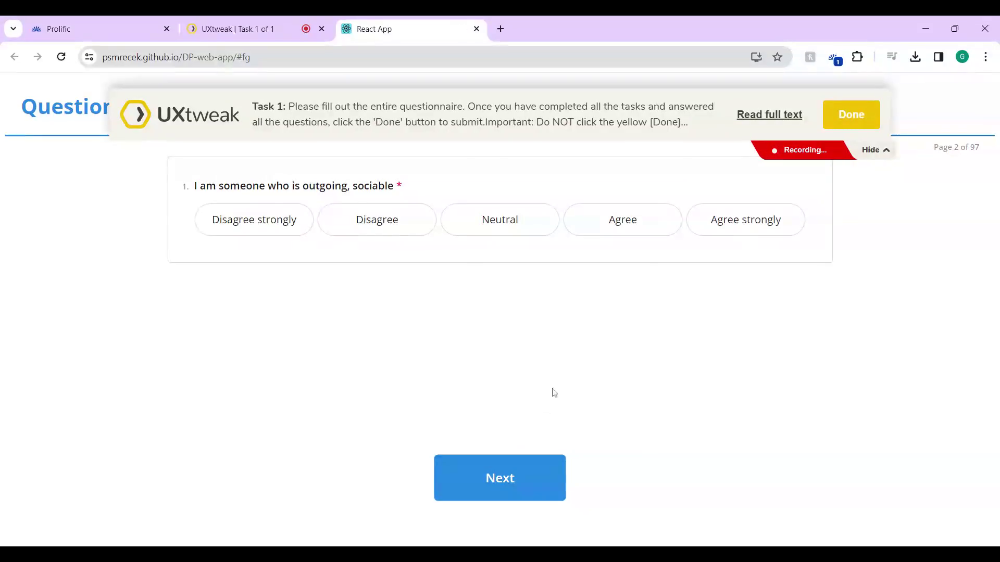
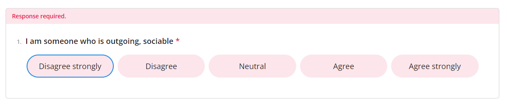
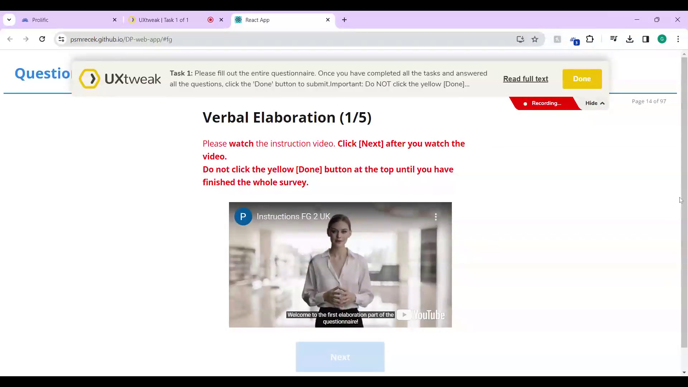
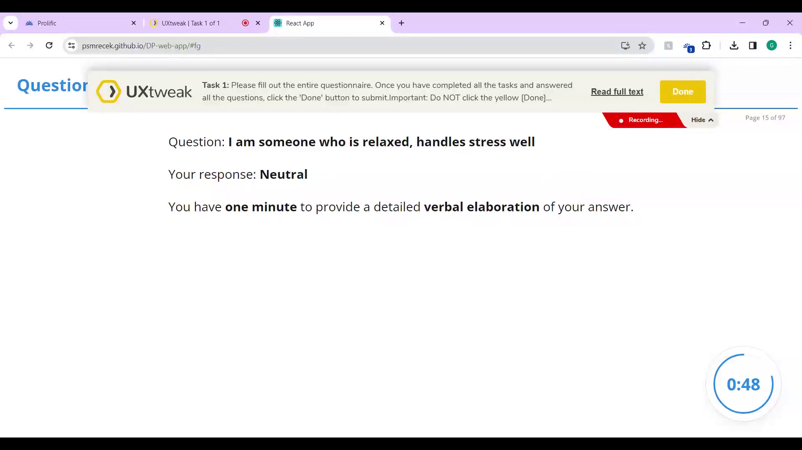
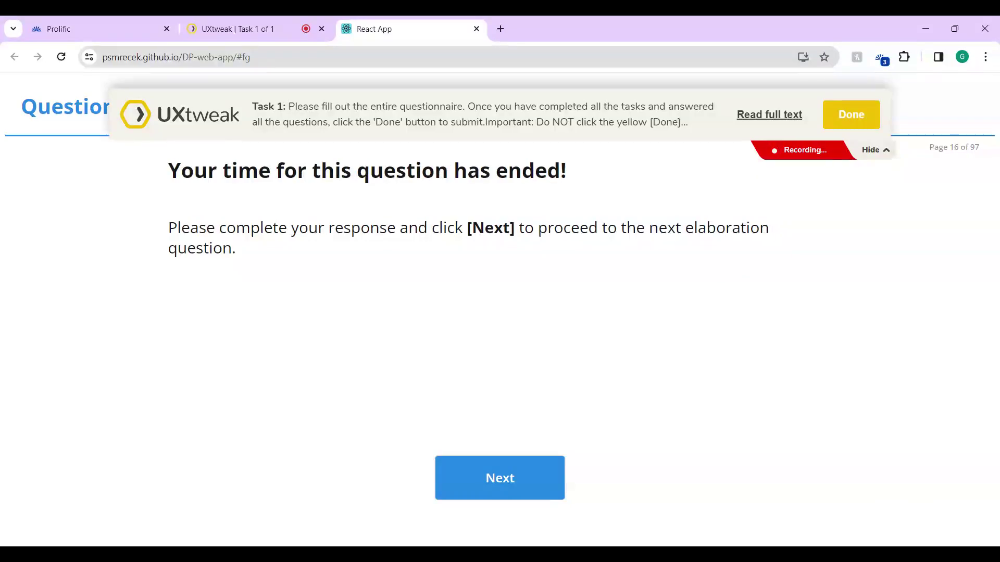
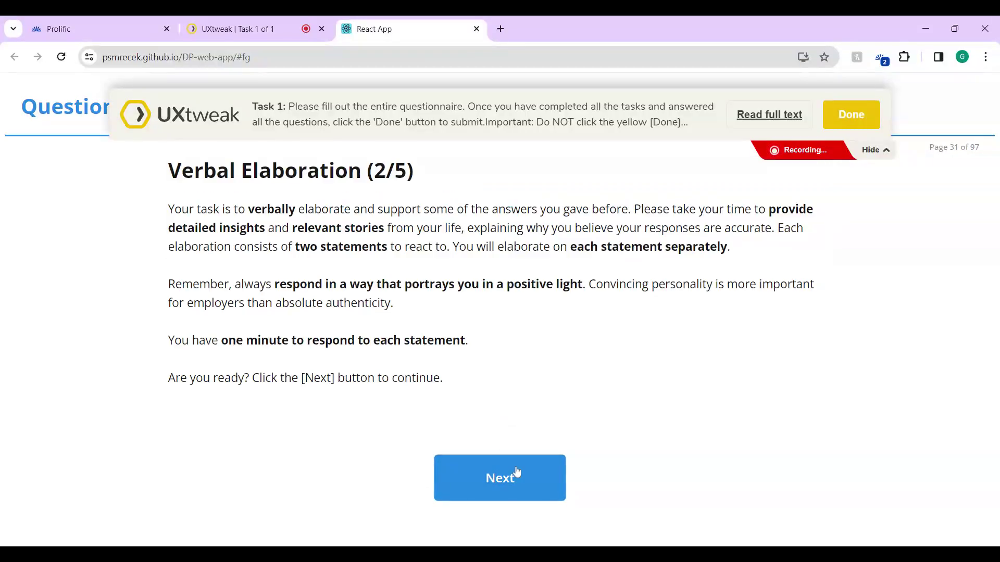
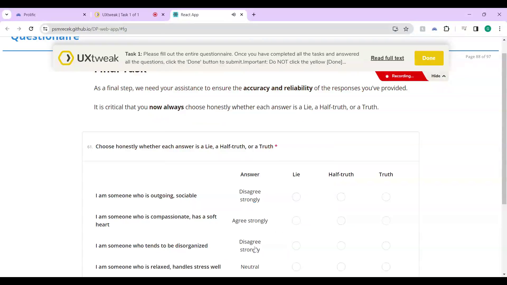
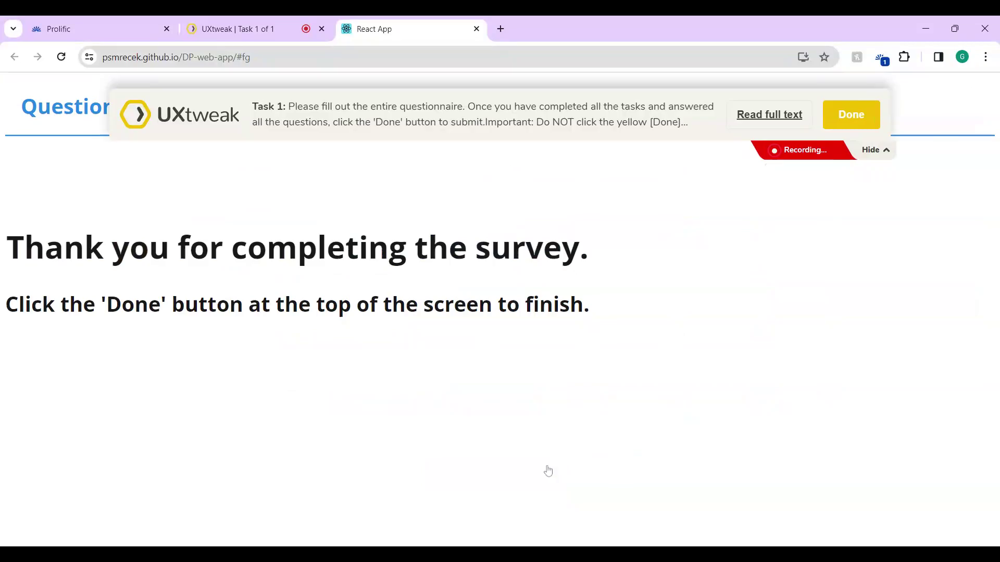

# Can Behavioral Features Reveal Lying in an Online Personality Questionnaire? The Impact of Mouse Dynamics and Speech

## About

This is the official repository for the research paper *"Can Behavioral Features Reveal Lying in an Online Personality Questionnaire? The Impact of Mouse Dynamics and Speech"*. The study investigates approaches for detecting deceptive answers in online personality assessments in real-world conditions, focusing on mouse dynamics and introducing speech-based features from verbal responses. Collected in an experiment conducted in an in-the-wild setting with 64 participants, the dataset includes 3840 responses labeled as lying or honest. Our findings indicate that speech features may enhance detection where mouse-based methods fall short, although a prediction model that leverages purely speech-based features was constrained in its prediction performance. This repository provides the dataset, screenshots documenting the design of the experiment, and scripts related to data analysis, feature extraction and construction of machine learning models.

### Table of contents

* [Paper citation](#paper-citation)
* [Dataset](#dataset)
* [Designs](#designs)
* [Scripts](#scripts)
* [Authors](#authors)
* [License](#license)

## Paper citation

TODO

## Dataset

### **0 - [Raw Data](./analysis/data/0_Raw_Data/)**

Part of raw data (metadata and demographic data) in tabular exports. For access to recordings, please contact the authors.

### **1 - [Processed Big 5 Data](./analysis/data/1_SurveyJS_Big5_Data_Processing/)**

Evaluation of the Big 5 questionnaire and calculation of results based on the [Big 5 methodology](https://www.colby.edu/academics/departments-and-programs/psychology/research-opportunities/personality-lab/the-bfi-2/).

### **2 - [Raw Mouse Data](./analysis/data/2_UXtweak_Mouse_Data_Downloading/)**

Interaction data, both raw and summarized, that were downloaded from the usability testing tool [UXtweak](https://www.uxtweak.com/).

### **3 - [Processed Mouse Data](./analysis/data/3_UXtweak_Mouse_Data_Processing/)**

Summarized interaction data enriched with precise time (and other) characteristics obtained from raw data.

### **4 - [Paired Data](./analysis/data/4_Pair_UXtweak_and_SurveyJS/)**

Matched data from Big 5 and UXtweak, prepared for further processing.

## Designs
[Screenshots of the questionnaire](./designs) that our respondents were filling out.

<table>
  <tr>
    <td align="center">Welcome screen</td>
    <td align="center">Question</td>
  </tr>
  <tr>
    <td align="center">Unanswered Likert scale</td>
    <td align="center">Video instructions for first verbal elaboration </td>
  </tr>
  <tr>
    <td align="center">Verbal elaboration</td>
    <td align="center">Verbal elaboration end</td>
  </tr>
  <tr>
    <td align="center">Textual instructions for verbal elaborations 2-5</td>
    <td align="center">Ground truth video instructions</td>
  </tr>
  <tr>
    <td align="center">Ground truth matrix</td>
    <td align="center">End of the questionnaire</td>
  </tr>
</table>

Video instructions for Honest version:
[General instructions](https://www.youtube.com/embed/0i9Sy7pZWcg?),
[Elaboration segment instructions](https://www.youtube.com/embed/B3fmEYIlziY?),
[Truth check segment instructions](https://www.youtube.com/embed/ZBoX1kwQOgs?)

Video instructions for Faking Good version:
[General instructions](https://www.youtube.com/embed/cSij45rBZrQ?),
[Elaboration segment instructions](https://www.youtube.com/embed/R5EyO_h85W4?),
[Truth check segment instructions](https://www.youtube.com/embed/ke2ExCyqAfs?)

## Scripts

All of the scripts are written in Python (version 3.10.7) and with other external libraries installed using pip (version 24.0). Scripts are executed using jupyter notebooks. A [requirements file](./analysis/requirements.txt) is provided for installing dependencies. After installing Python, the below commands can be used in the analysis directory to install the environment and launch the notebooks:
```
python -m venv .venv
.venv\Scripts\activate
pip install -r requirements.txt
jupyter notebook
```

This will create your virtual environment, install the dependencies and launch the python notebooks with the analysis files. After the installation, to launch the notebooks again, use these commands:

```
.venv\Scripts\activate
jupyter notebook
```

### **1 - [Big5 Data Processing](./analysis/scripts/1_SurveyJS_Big5_Data_Processing.ipynb)**

Contains an analysis of data collected from the Big 5 questionnaire and a visualization of relationships within the data.

### **2 - [Mouse Data Downloading](./analysis/scripts/2_UXtweak_Mouse_Data_Downloading.ipynb)**

Used to download interaction data, both raw and summarized, from the website usability testing tool [UXtweak](https://www.uxtweak.com/website-usability-testing-tool) and save it locally.

### **3 - [Mouse Data Processing](./analysis/scripts/3_UXtweak_Mouse_Data_Processing.ipynb)**

Loads summarized interaction data and enriches it with precise time (and other) characteristics obtained from raw data.

### **4 - [Data Pairing](./analysis/scripts/4_Pair_UXtweak_and_SurveyJS.ipynb)**

Loads responses from the questionnaire and converts them into a string. It also loads responses obtained from interaction data and converts them into a string. By comparing these strings, data from UXtweak and SurveyJS can be matched.

### **5 - [Replay Trajectory](./analysis/scripts/5_Replay_Trajectory.ipynb)**

Used to visualize the collected trajectories.

### **6 - [Elaborations Extraction](./analysis/scripts/6_Elaborations_Extraction.ipynb) and [Remove Pauses](./analysis/scripts/6_2_Remove_Pauses.ipynb)**

Cuts out sections with verbal elaborations from the entire screen recording. The script saves the cut sections in an organized file structure.

Cuts out silences below 50 dBFS in amplitude that last over 2000 ms from the recordings.

### **7 - [Elaborations Transcripts](./analysis/scripts/7_Elaborations_Transcripts.ipynb), [Elaborations Transcripts From Chunks](./analysis/scripts/7_2_Elaborations_Transcripts_From_Chunks.ipynb) and [Combine Chunks](./analysis/scripts/7_3_Combine_Chunks.ipynb)**

Creates transcripts of verbal elaborations using two approaches—OpenAI’s Whisper model and Google Speech-to-Text service. Based on the selected strategy, it is possible to use original data or chunked data. In the latter case, chunks need to be combined back together.

### **8 - [Transcripts Processing GPT](./analysis/scripts/8_Transcripts_Processing_GPT.ipynb)**

Used to test the applicability of GPT models in this solution. The output from this script is not used in the production version and serves only as a proof of concept.

### **9 - [Transcripts Analysis](./analysis/scripts/9_Transcripts_Analysis.ipynb)**

Contains an evaluation of data obtained from the previous notebook. The output from this script is not used in the production version and serves only as a proof of concept.

### **10 - [Zero Words Analysis](./analysis/scripts/10_Zero_Words_Analysis.ipynb)**

Identifies issues with transcripts by comparing the outputs of the Whisper model with the Google Speech-to-Text service.

### **11 - [Pause Defined Units](./analysis/scripts/11_Pause_Defined_Units.ipynb)**

Divides recordings into units defined by pauses. These units are then used in feature extraction to obtain acoustic, speech-temporal, syntactic, and semantic machine learning features. The code for obtaining acoustic metrics is sourced from [PraatScripts on GitHub](https://github.com/drfeinberg/PraatScripts/tree/master)

### **12 - [PDU Aggregations and Models](./analysis/scripts/12_PDU_Aggregations_and_Models.ipynb)**

Prepares data and trains models based on acoustic, linguistic, and contextual machine learning features. The data are loaded, split into training and testing sets, sampled, normalized, statistically tested, and saved continuously. Machine learning features are then selected, models are trained, optimal hyperparameters are found, and cross-validation is used to check the stability of the models. The models are evaluated on the test dataset.

### **13 - [Mouse Data Preparation](./analysis/scripts/13_Mouse_Data_Preparation.ipynb)**

Used to obtain metrics of mouse movement trajectories, and process trajectory coordinates into a format suitable for a neural network.

### **14 - [Mouse Model](./analysis/scripts/14_Mouse_Model.ipynb)**

Prepares data and trains models based on features of participants' mouse movements. The data are loaded, split into training and testing sets, sampled, normalized, statistically tested, and saved continuously. Machine learning features are then selected, models are trained, optimal hyperparameters are found, and cross-validation is used to check the stability of the models. The models are evaluated on the test dataset.

### **15 - [Neural Net Model](./analysis/scripts/15_Neural_Net_Model.ipynb)**

Processes data for the training of a neural network, including the neural network architecture and training loop. The trained neural network is saved for further evaluation and use.

### **16 - [Evaluation](./analysis/scripts/16_Evaluation.ipynb)**

Compares all approaches. Results from each approach are loaded, the best model is selected, loaded, and evaluated. Graphs from this notebook are used in the thesis text.

### **17 - [Graphs and Charts](./analysis/scripts/17_Graphs_and_Charts.ipynb)**

Creates visualizations of relationships within the data. Graphs from this notebook are used in the thesis text.

## Authors

### General contact 

Email: imds.research@gmail.com

**Eduard Kuric**\
He received his PhD degree in computer science from the [Faculty of Informatics and Information Technologies](https://www.fiit.stuba.sk/), [Slovak University of Technology in Bratislava](https://www.stuba.sk/). He is a researcher and assistant professor at the same university. His research interests include human-computer interaction, user modeling, personalized web-based systems, and machine learning. Eduard is also the head of the UX Research Department and the founder of [UXtweak](https://www.uxtweak.com/).
- [LinkedIn](https://www.linkedin.com/in/eduard-kuric-b7141280/)
- [Google Scholar](https://scholar.google.com/citations?user=MwjpNoAAAAAJ&hl=en&oi=ao)
- Email: eduard.kuric([AT])stuba.sk

**Peter Demcak**\
He received his master’s degree in computer science from the [Faculty of Informatics and Information Technologies](https://www.fiit.stuba.sk/), [Slovak University of Technology in Bratislava](https://www.stuba.sk/). He is a researcher with background in software engineering, whose current topics of interest involve user behavior, human-computer interaction, UX research methods & design practices, and machine learning. Currently occupies the position of a scientific and user experience researcher at [UXtweak](https://www.uxtweak.com/), with focus on research that supports work of UX professionals.
- Email: peter.demcak([AT])uxtweak.com

**Peter Smrecek**\
He received his master’s degree in computer science from the [Faculty of Informatics and Information Technologies](https://www.fiit.stuba.sk/), [Slovak University of Technology in Bratislava](https://www.stuba.sk/). He is a data scientist with a focus on machine learning, big data, unstructured data processing, and natural language processing.
- [LinkedIn](https://www.linkedin.com/in/peter-smrecek/)
- Email: petersmrecek([AT])gmail.sk

**Stefan Benus**\
He is an Assistant Professor at [Constantine the Philosopher University in Nitra, Slovakia](https://www.ukf.sk/en/university). He completed his PhD at New York University and has previously worked at Columbia University and Brown University, USA. Research interests: the relationship between phonetics and phonology with a special interest in the articulatory characteristics of speech; the relationship between speech prosody and pragmatic/discourse aspect of the message as well as the emotional state of the speaker delivering the message; possibilities of applying the knowledge of these relationships in speech applications (synthesis, recognition, dialog systems) and in language acquisition.
- Email: sbenus([AT])ukf.sk

## License
This work is licensed under a [Creative Commons Attribution-NonCommercial 4.0 International License](http://creativecommons.org/licenses/by-nc/4.0/).

[](http://creativecommons.org/licenses/by-nc/4.0/)
